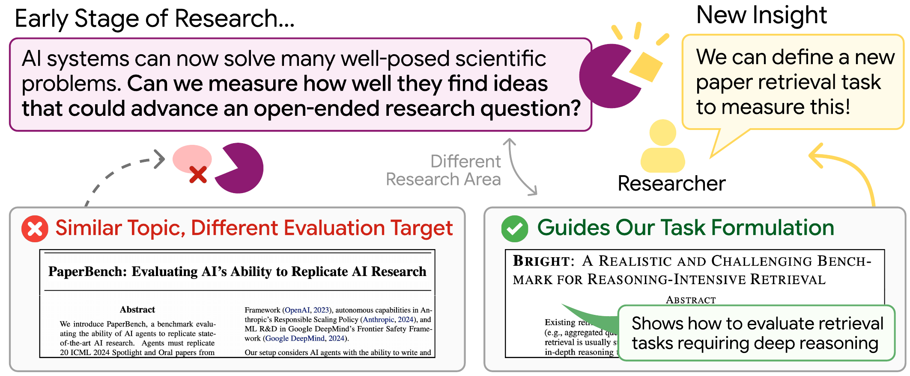

<h1 align="center">Scholaratalyst: A Benchmark for Retrieving Papers that Inspire New Research</h1>

<p align="center">
  <a href="https://ohmyksh.github.io/project/ScholarCatalyst">Website</a> •
  <a href="https://arxiv.org/abs/2610.02202">Paper</a> •
  <a href="https://huggingface.co/datasets/ScholarCatalyst/ScholarCatalyst">Data</a>
</p>

<p align="center">
  <a href="https://huggingface.co/datasets/ScholarCatalyst/ScholarCatalyst">
    
  </a>
  <a href="https://creativecommons.org/licenses/by-nc/4.0/deed.en">
    
  </a>
</p>

<p align="center">
  <br>
  
</p>

ScholarCatalyst is a literature inspiration retrieval benchmark grounded in researchers' firsthand knowledge of their own projects. 184 researchers who led 207 recent computer science projects verified 894 research questions as they stood before each project's key findings, then labeled which prior papers did or could have advanced their work and explained why, including papers they had not encountered at the time.

## 🤗 Data

ScholarCatalyst covers 207 source papers and 191k candidate documents. Queries number 894 in total, 207 `core_query` and 687 `subfield_query`. See the [Hugging Face page](https://huggingface.co/datasets/ScholarCatalyst/ScholarCatalyst) for the full schema.

**Benchmark Contributors**: We are deeply grateful to the researchers who reviewed our reconstruction of their own work and shared the reasoning behind which prior work genuinely shaped their research. You can see their full names [here](CONTRIBUTORS.md).

## Quick start

```bash
# install
pip install -r requirements.txt
# set OPENAI_API_KEY, ANTHROPIC_API_KEY, or GEMINI_API_KEY in .env, whichever the baseline you run needs

# download the data
python -c "
from huggingface_hub import snapshot_download
snapshot_download('ScholarCatalyst/ScholarCatalyst', repo_type='dataset', local_dir='BENCH_DIR')
"
export BENCH_DIR=$(pwd)/BENCH_DIR

# model setup
cd src/evaluation
```

Then pick a baseline below, embedding model or agentic search.

## Evaluation

### Embedding model baselines

```bash
python download_retrieval_models.py --models <model>   # or: --models all
python encode_corpus.py --model <model> --bench-dir $BENCH_DIR
python retrieve.py      --model <model> --bench-dir $BENCH_DIR
python evaluate.py      --model <model> --bench-dir $BENCH_DIR
```

Model choices are managed in `src/evaluation/config.py`'s `MODEL_REGISTRY`.

### Agentic Search Baselines

`agentic_search.py` runs an agent that searches the corpus itself instead of
querying a fixed index.

- `grep` gets a bash tool and greps the corpus directly.
- `toolcall` gets `search` and `expand` tool calls over a retriever.
- `deepresearch` plans sub questions, then searches and reads with periodic reflection before synthesizing an answer.

Pass any model id through `--model`, and pass the fallback retriever through `--backfill`, `bm25` or any embedding model already encoded with `encode_corpus.py`.

```bash
python agentic_search.py --agent toolcall --model <model> --bench-dir $BENCH_DIR
python evaluate.py       --model agentic/toolcall-bm25 --bench-dir $BENCH_DIR
```

## Citation

If you find our work helpful, please cite us.

```bibtex
@article{kim2026scholarcatalyst,
    title   = {ScholarCatalyst: A Benchmark for Retrieving Papers that Inspire New Research},
    author  = {Kim, Sohyeon and Lee, Yoonho and Liu, Bo and Ko, Dayoon and Shao, Rulin and Kim, Seungone and Neubig, Graham and Koh, Pang Wei and Chowdhery, Aakanksha and Asai, Akari and Khattab, Omar and Choi, Yejin and Kim, Gunhee and Finn, Chelsea},
    journal = {arXiv preprint arXiv:2610.02202},
    year    = {2026}
}
```
